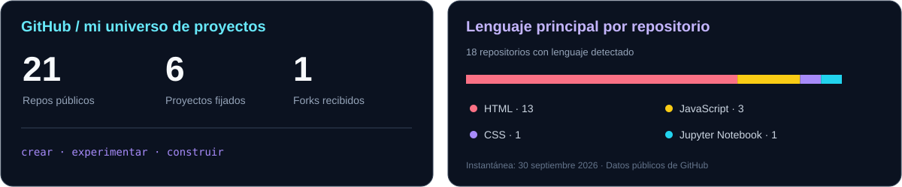

  

  
  

### Hola, soy Anthony 👋

Creo interfaces web que combinan funcionalidad, diseño y movimiento. Mis proyectos exploran tiendas digitales, sitios para negocios y experiencias interactivas.

- 💻 Desarrollo web con **HTML, CSS y JavaScript**.
- 🛒 Catálogos, buscadores y carritos de compra para comercios.
- ✨ Animaciones e interfaces con personalidad.
- 🧩 También exploro backend, bases de datos y automatización.

### Proyectos destacados

| Proyecto | Qué encontrarás |
| :--- | :--- |
| 🖥️ **[Matrixx Electronics](https://github.com/Anthonylwz/Matrixx-Electronics)** | Catálogo de tecnología con categorías, búsqueda, carrito y promociones. |
| 🐾 **[Veterinaria Pariona](https://github.com/Anthonylwz/veterinaria)** | Sitio de servicios veterinarios, tienda y asistente conversacional integrado. |
| 🍗 **[La Chacra](https://github.com/Anthonylwz/polleria)** | Experiencia gastronómica con platos animados en 3D, menú y buscador. |
| 🌎 **[PeruMeetsWorld](https://github.com/Anthonylwz/PeruMeetsWorld)** | Proyecto web con integración de carga de contenido mediante Cloudinary. |
| 👨‍💻 **[Portafolio personal](https://github.com/Anthonylwz/cv-anthony)** | Presentación profesional, experiencia, tecnologías y proyectos. |

### Tecnologías & herramientas

  

### GitHub en números

  

Ver tecnologías en detalle

  
  
  
  
  
  
  
  

Ideas → código → experiencias que se mueven.

