  

  <a href="#tecnologías--herramientas">Tecnologías</a> &nbsp; · &nbsp;
  <a href="#cómo-las-utilizo">Cómo las utilizo</a> &nbsp; · &nbsp;
  <a href="https://github.com/Anthonylwz?tab=repositories">Código público</a>

### Hola, soy Anthony 👋

Trabajo con **interfaces web, aplicaciones PHP y bases de datos MySQL**. En mis repositorios también hay interfaces con **React**, estilos con **Tailwind CSS**, animaciones con **Motion** y notebooks de **Python con pandas**.

### Tecnologías & herramientas

**Web y frontend**

  
  
  
  
  
  
  

HTML5 · CSS3 · JavaScript · React · Vite · Tailwind CSS · Motion

**Backend y datos**

  
  
  

PHP · MySQL · Firebase Cloud Messaging

**Python y notebooks**

  
  
  

Python · pandas · Notebooks (.ipynb)

**Control de versiones**

  
  

Git · GitHub

### Cómo las utilizo

| Herramientas | Uso presente en mi código |
| :--- | :--- |
| **HTML, CSS y JavaScript** | Páginas web, estilos, buscadores, navegación, carrito y animaciones. |
| **React y Vite** | Componentes JSX, montaje de la aplicación y configuración del entorno de desarrollo. |
| **Tailwind CSS** | Estilos mediante utilidades y configuración de hojas de estilo. |
| **Motion** | Animaciones con `motion` y transiciones con `AnimatePresence`. |
| **PHP y MySQL** | Controladores, modelos, consultas SQL y conexión a MySQL mediante PDO. |
| **Firebase Cloud Messaging** | Envío de notificaciones mediante la API HTTP de FCM. |
| **Python y pandas** | Ejercicios con Series y DataFrames, filtros, operaciones y lectura/escritura de CSV. |
| **Git y GitHub** | Historial de versiones y gestión de repositorios. |

### GitHub en números

  

Datos públicos actualizados diariamente. La distribución cuenta repositorios; no representa nivel de dominio.

