

  

  <a href="https://github.com/Anthonylwz/cv-anthony"></a>
  
  

## Hola, soy Anthony 👋

Estudio **Ingeniería de Software con IA en SENATI**. Me interesa crear soluciones que conecten una interfaz cuidada, lógica útil y datos bien organizados. Mi recorrido combina desarrollo web, proyectos para negocios y experiencia en soporte e infraestructura de cómputo.

Me gusta experimentar con **animaciones, catálogos digitales, buscadores y carritos de compra**. También trabajo y aprendo con Python, PHP, bases de datos relacionales y servicios cloud. Este perfil reúne proyectos que muestran distintas partes de ese camino.

  

## Tecnologías & herramientas

  

<b>Ver cómo aplico estas tecnologías</b>

| Área | Tecnologías | Aplicación |
| :--- | :--- | :--- |
| **Interfaz web** | HTML5 · CSS3 · JavaScript | Estructura, estilos, navegación, interacción y animaciones. |
| **Backend y scripts** | Python · PHP | Lógica de aplicaciones, APIs y automatización; áreas descritas en mi portafolio. |
| **Datos** | SQL Server · MySQL | Modelado relacional, consultas y organización de información. |
| **Cloud** | Firebase | Integración de servicios, autenticación y datos en tiempo real. |
| **Flujo de trabajo** | Git · GitHub | Control de versiones y publicación de proyectos. |
| **Soporte técnico** | Hardware · Redes · Sistemas operativos | Diagnóstico, mantenimiento e infraestructura de cómputo. |

Estas herramientas describen mi recorrido y mis áreas de trabajo y aprendizaje. Los repositorios públicos permiten explorar las implementaciones de cada proyecto.

## Proyectos destacados

Seis proyectos, seis enfoques: comercio, servicios, animación, gestión, contenido e identidad profesional. **Haz clic en una tarjeta para explorar su repositorio.**

<table>
  <tr>
    <td width="50%"><a href="https://github.com/Anthonylwz/Matrixx-Electronics"></a></td>
    <td width="50%"><a href="https://github.com/Anthonylwz/veterinaria"></a></td>
  </tr>
  <tr>
    <td width="50%"><a href="https://github.com/Anthonylwz/polleria"></a></td>
    <td width="50%"><a href="https://github.com/Anthonylwz/exportacion"></a></td>
  </tr>
  <tr>
    <td width="50%"><a href="https://github.com/Anthonylwz/PeruMeetsWorld"></a></td>
    <td width="50%"><a href="https://github.com/Anthonylwz/cv-anthony"></a></td>
  </tr>
</table>

<b>Explorar funciones y decisiones de cada proyecto</b>

### 🖥️ Matrixx Electronics

Catálogo de productos tecnológicos con categorías, búsqueda, promociones y carrito. El proyecto reúne navegación comercial y componentes interactivos para explorar productos, revisar detalles y seleccionar cantidades.

**Explora:** organización del catálogo, controles del carrito, filtros y experiencia de compra.

### 🐾 Veterinaria Pariona

Sitio orientado a servicios veterinarios y venta de productos para mascotas. Integra páginas de servicios, contacto, carrito y un asistente conversacional con Voiceflow.

**Explora:** navegación entre servicios y tienda, presentación de productos e integración del asistente.

### 🍗 La Chacra

Una experiencia gastronómica que usa imágenes de platos en una escena con profundidad y animación. Incluye menú, búsqueda con sugerencias, páginas de detalle y acceso a contacto.

**Explora:** uso de transformaciones 3D, animación con JavaScript y búsqueda de platos.

### 📦 Exportaciones Peruanas

Interfaz de un sistema de gestión de exportaciones, con pantalla de acceso y navegación vinculada a roles. Es un proyecto para explorar presentación de información y flujos de gestión.

**Explora:** estructura de la interfaz, navegación y organización de pantallas.

### 🌎 PeruMeetsWorld

Proyecto web que incorpora el widget de carga de Cloudinary para integrar contenido. Amplía mis experimentos con interacción y servicios externos.

**Explora:** integración del widget de carga y comportamiento de la página.

### 👨‍💻 Portafolio personal

Presentación de mi perfil profesional, experiencia, formación y tecnologías, con acceso al currículum y una selección de proyectos.

**Explora:** jerarquía de contenido, presentación de experiencia y navegación entre secciones.

## Mi recorrido

  

<b>Formación y experiencia en detalle</b>

| Periodo | Organización | Enfoque |
| :--- | :--- | :--- |
| **2024–2026** | **SENATI** | Formación en Ingeniería de Software con IA. Desarrollo de software, soluciones full stack e IoT. |
| **Marzo–julio 2025** | **Matrixx Electronics** | Técnico en Computación. Hardware y soporte técnico. |
| **Agosto–diciembre 2025** | **PC SYSTEM** | Técnico de Computadoras. Diagnóstico, mantenimiento y optimización. |
| **Desde febrero 2025** | **SIA CETPRO** | Auxiliar de Sistemas. Soporte e infraestructura de cómputo. |

Más contexto en mi [portafolio profesional](https://github.com/Anthonylwz/cv-anthony) y [currículum](https://github.com/Anthonylwz/cv-anthony/blob/main/cv-anthony.pdf).

## Mi actividad en GitHub

  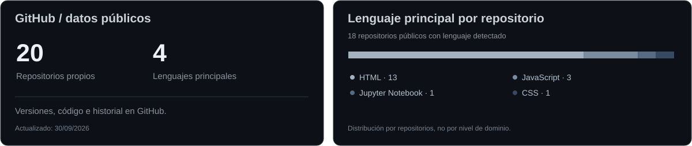

Las métricas se actualizan diariamente con datos públicos. La distribución cuenta el lenguaje principal por repositorio y excluye este repositorio de presentación.

## Lo que quiero seguir construyendo

- **Interfaces con personalidad:** movimiento que acompañe la navegación y el contenido.
- **Soluciones para negocios:** catálogos, formularios y flujos de gestión más claros.
- **Aplicaciones conectadas:** frontend, backend y bases de datos trabajando juntos.
- **Automatización útil:** scripts y herramientas que simplifiquen tareas repetitivas.

  <a href="https://github.com/Anthonylwz/cv-anthony"></a>

Diseño propio · Gráficos vectoriales animados · Código y proyectos públicos

